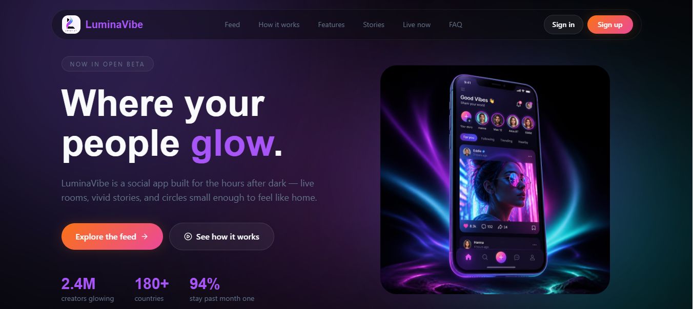
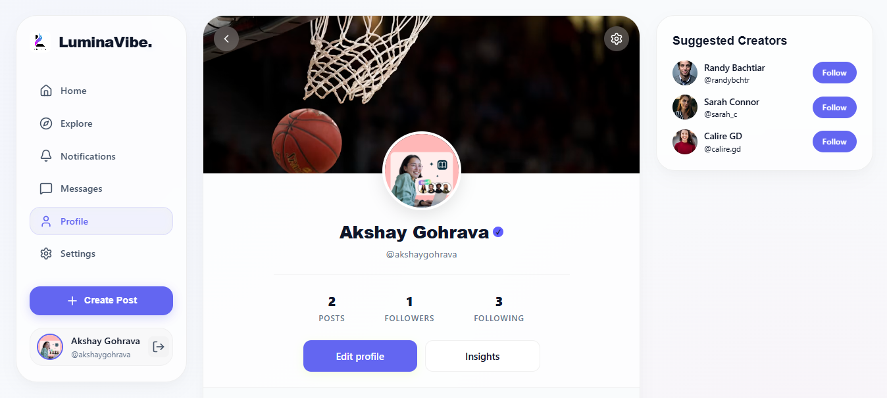
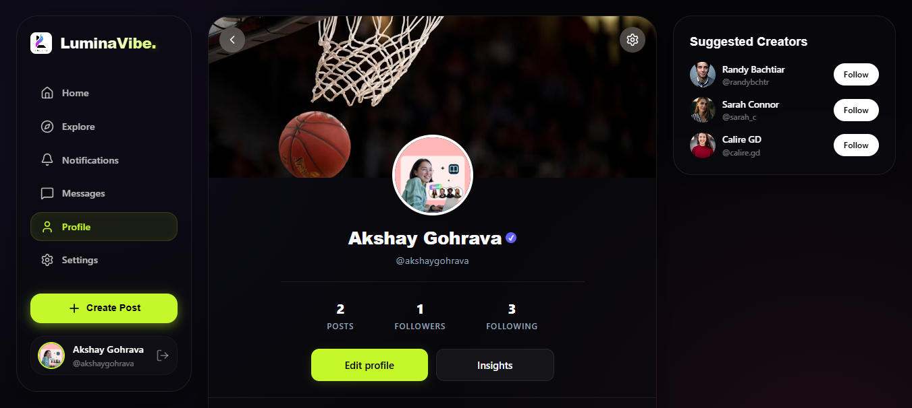
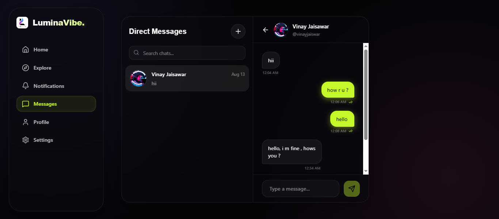
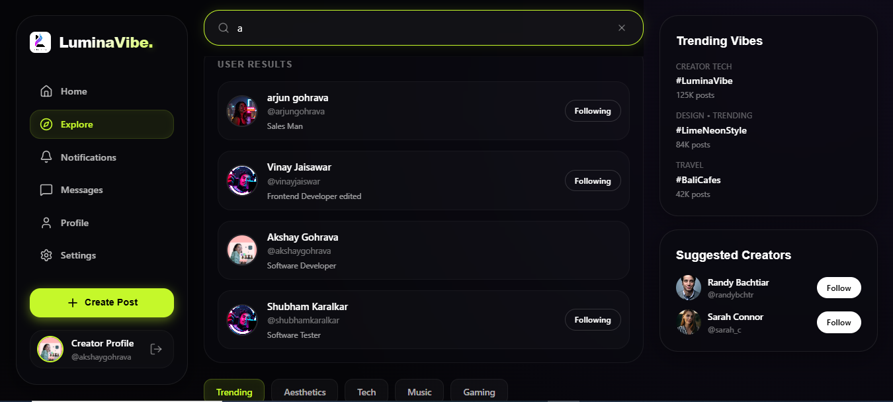
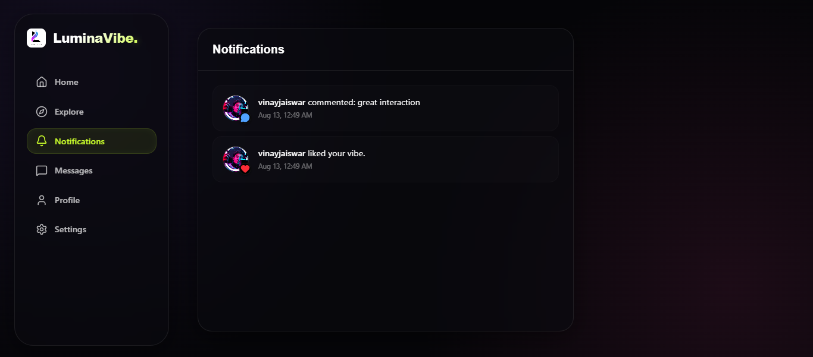
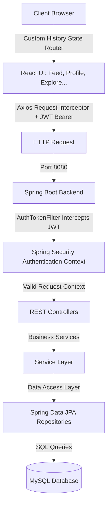

# LuminaVibe - Next-Gen Social Media Experience ✨

<div align="center">



[](https://react.dev)
[](https://vite.dev)
[](https://tailwindcss.com)
[](https://spring.io/projects/spring-boot)
[](https://www.mysql.com)
[](https://openjdk.org)

[](https://luminavibe.vercel.app)
[](https://api.luminavibe.com)
[](LICENSE)

</div>

## 🌟 Overview

**LuminaVibe** is a modern, high-performance, full-stack social media application designed for the 2026 AI era. It connects people through beautiful shared moments, offering a rich UI, real-time-like social feeds, interactive media carousels, and profile analytics. 

Engineered with a **Spring Boot** backend and a reactive **Vite + React** frontend styled with **Tailwind CSS v4**, LuminaVibe demonstrates robust full-stack design patterns including custom client-side history routing, JWT-based security filtering, and multi-relation database indexing.

<div align="center">

[](https://skillicons.dev)

</div>

---

## 📸 Screenshots & User Interface

<div align="center">
  <table width="100%">
    <tr>
      <td width="50%" align="center">
        <b>🌐 Landing Page (Modern Hero UI)</b>
        <br/>
        
      </td>
      <td width="50%" align="center">
        <b>🌒 Dark Mode Feed</b>
        <br/>
        
      </td>
    </tr>
    <tr>
      <td width="50%" align="center">
        <b>👤 User Profile & Insights Dashboard</b>
        <br/>
        
      </td>
      <td width="50%" align="center">
        <b>💬 Interactive Direct Messaging</b>
        <br/>
        
      </td>
    </tr>
    <tr>
      <td width="50%" align="center">
        <b>🔍 Explore & Real-time User Search</b>
        <br/>
        
      </td>
      <td width="50%" align="center">
        <b>🔔 Live Connection Notifications</b>
        <br/>
        
      </td>
    </tr>
  </table>
</div>

---

## 🚀 Live Demo & Resources
| Resource | Link |
| :--- | :--- |
| **🌐 Live Application** | [luminavibe.vercel.app](https://luminavibe.vercel.app) |
| **📡 Backend API** | [api.luminavibe.com](https://api.luminavibe.com) |
| **📚 API Documentation** | Swagger UI (e.g. `/swagger-ui/index.html`) |

---

## 🏗️ System Architecture

LuminaVibe utilizes a clean separation of concerns, routing client interactions via a custom history state router, communicating through a stateless HTTP client with bearer tokens, and securing API endpoints with filter interceptors.



---

## ✨ Features

### 👤 Core & User Management
| Category | Features | Status |
| :--- | :--- | :---: |
| **👤 User Management** | Registration (`POST /users`), JWT Login, Auth persistence via localStorage | ✅ |
| **📝 Posts** | Create (Multipart form with files), Edit, Delete, Media Attachments, Location metadata | ✅ |
| **💬 Social Interactions** | Nested Comments, Likes toggle on targets, Comment thread expansion | ✅ |
| **🔗 Connections** | Follow/Unfollow, Request/Accept/Reject system for connections | ✅ |
| **🔒 Privacy & Settings** | Public/Private Accounts, customized notifications toggles, profile deletion | ✅ |

### 📸 Rich Media & Real-time Features
| Category | Features | Status |
| :--- | :--- | :---: |
| **📸 Stories** | 24hr vanishing image stories via multipart upload, interactive view | ✅ |
| **🎥 Reels** | Short Video sharing, media player component integration | ✅ |
| **💭 Messages** | Private messages history, conversation listings, unread counters, chat interface | ✅ |
| **🔴 Live Streaming** | Live broadcasting setups, viewer comments interface, co-streaming | 🚧 |
| **📊 Analytics** | Profile Insights (Likes, Comments, Profile Views, and computed Engagement Rate) | ✅ |

### 🎯 Gamification & AI Features
| Category | Features | Status |
| :--- | :--- | :---: |
| **🏆 Gamification** | Achievements tracker, badges, user streak calculations, leaderboards | ✅ |
| **💰 Monetization** | Creator tipping system, premium subscriptions, shop items | 🚧 |
| **🗳️ Polls & Quizzes** | Interactive post quizzes, community surveys, Q&A widgets | ✅ |
| **📅 Events** | Group events creator, RSVP lists, schedule reminders | ✅ |
| **🤖 AI Features** | Smart content moderation filters, automated hashtag extraction, post recommendations | 🚧 |

---

## 🛠️ Technology Stack

### Frontend 🎨
*   **⚛️ React (v19.2.6)** — Harnesses the latest concurrent rendering features and transition hooks.
*   **⚡ Vite (v8.0.12)** — Fast, lightweight ESM-based bundler and dev server.
*   **🎨 TailwindCSS (v4.3.3) & `@tailwindcss/vite`** — Zero-runtime utility engine compiling directly in the Vite pipeline for instant styles.
*   **📋 React Hook Form (v7.84.0)** — Uncontrolled form validation minimizing page re-renders.
*   **🎠 Embla Carousel React (v8.6.0)** — Fluid, hardware-accelerated slider for posts, reels, and stories.
*   **📡 Axios (v1.19.0)** — Configured with request interceptors to automatically inject JWT authentication headers.
*   **🧭 Custom Browser Router** — A lightweight, high-performance state-based router listening to `popstate` and `navigate` events to provide SPA navigation without the footprint of heavy external libraries.

### Backend ⚙️
*   **🍃 Spring Boot (v4.1.0)** — High-performance foundation framework managing application context.
*   **🔐 Spring Security (v6.4.0)** — Secure method routing and customizable stateless filters.
*   **🔑 JJWT (v0.13.0)** — Lightweight libraries generating, parsing, and signing cryptographic JSON Web Tokens.
*   **📊 Spring Data JPA (v3.4.0) & Hibernate (v6.6.0)** — Automated database schema generation, criteria queries, and optimized persistence caching.
*   **🗄️ MySQL (v8.0)** — Optimized relational schema structure utilizing indices for queries.
*   **📦 ModelMapper (v3.2.6) & Jackson (v2.17.0)** — High-speed object mapping and JSON serialization.
*   **🐳 Docker** — Standardized container builds for quick service deployments.

---

## 🔒 Security Infrastructure
*   🔑 **Stateless JWT Authorization**: Requests validated on each entry via custom `AuthTokenFilter`.
*   🛡️ **BCrypt Hashing**: Passwords stored as one-way secure cryptographic hashes.
*   🌐 **CORS Configuration**: Restricts access to trusted client origins (e.g., `http://localhost:5173`).
*   🧪 **JPA Parameter Injection Protection**: Queries auto-sanitized to block SQL-injection vectors.
*   🛂 **Jakarta Input Validation**: Controller DTO payloads pre-validated before reaching service layers.

---

## 📡 API Reference

### 🔐 Authentication & Accounts
```typescript
POST   /users                         // Register new user profile (BCrypt hashing)
POST   /auth/login                    // Verify credentials, returns signed JWT & user details
DELETE /users/{id}                    // Permanently delete user profile and associated data
```

### 👤 Profile & Analytics
```typescript
GET    /users/username/{username}     // Retrieve public profile details by username
PUT    /users/{id}                    // Update user profile properties
POST   /users/upload-avatar           // Upload profile picture file (returns URL)
GET    /users/insights                // Compute profile engagement metrics (views, posts, likes, comments)
GET    /users/search?query=...        // Search user profiles
```

### 📝 Posts & Comments
```typescript
POST   /posts                         // Create new post (Multipart form-data supporting multiple media files)
GET    /posts                         // Retrieve global home feed posts
GET    /posts/user/{userId}           // Get all posts created by a specific user
PUT    /posts/{postId}                // Update post content or location
DELETE /posts/{postId}                // Delete post and associated media
POST   /posts/{postId}/comments       // Write comment (Supports thread nesting with parentCommentId)
GET    /posts/{postId}/comments       // Fetch nested comment tree for a post
```

### ❤️ Social Actions & Bookmarks
```typescript
POST   /likes/toggle                  // Toggle like status (Supports targetType: post/comment/story)
POST   /bookmarks/toggle/{postId}     // Toggle save status of a post
GET    /bookmarks                     // Retrieve list of currently bookmarked posts
```

### 🔗 Social Connections (Follows)
```typescript
POST   /follows/toggle/{targetUserId} // Follow or unfollow user
POST   /follows/accept/{followerId}   // Accept follow request (for private accounts)
POST   /follows/reject/{followerId}   // Reject follow request
GET    /follows/status/{targetUserId} // Check relationship status (following, requested, none)
GET    /follows/requests              // Retrieve pending incoming follow requests
GET    /follows/followers/{userId}    // List followers of user
GET    /follows/following/{userId}    // List users followed by user
```

### 📸 Stories & Vanishing Media
```typescript
POST   /stories                       // Upload a new story (Multipart media file)
GET    /stories                       // Fetch active stories from users they follow
```

### 💬 Direct Messaging
```typescript
POST   /messages                      // Send private message (JSON content, receiverId)
GET    /messages/history/{otherUserId}// Fetch full chat transcript history with a user
GET    /messages/conversations        // List active chat rooms / conversations
PUT    /messages/read/{senderId}      // Mark all messages from sender as read
GET    /messages/users                // List available users to initiate chats
GET    /messages/unread-count         // Fetch total unread private messages
```

### 🔔 Notifications & Settings
```typescript
GET    /notifications                 // List recent notifications (likes, follows, comments, messages)
GET    /notifications/unread-count    // Get count of unread notifications
PUT    /notifications/read            // Mark all notifications as read
GET    /settings/{userId}             // Fetch application configurations (themes, privacy status)
PUT    /settings/{userId}             // Save application configuration updates
```

---

## 🤖 2026 AI Era Portability & LLM Context

As an application built for the modern AI ecosystem, LuminaVibe features design choices optimized for **AI Agent interaction and code explanation**:
*   **Fully-typed REST Schema**: Explicit DTO objects (`UserDto`, `PostDto`, etc.) ensure LLM prompts and context builders parse API responses with zero ambiguity.
*   **Stateless Operations**: A clean JWT execution model facilitates easy testing using headless AI scrapers or automated integration pipelines.
*   **Mermaid Visualization**: Visual architectures structured in native markdown syntax allow immediate structural processing by multi-modal AI systems.

*Planned AI Integrations (🚧 Under Construction)*:
*   **Gemini Content Guard**: Integration in `PostController` to screen post captions and images for automated safety classification.
*   **Interactive Chat Assistant**: Embedding vector search based on user profile logs to answer queries about past feeds.

---

## 🚀 Quick Start

### Prerequisites
*   [Node.js (v20+)](https://nodejs.org/) & [npm](https://www.npmjs.com/)
*   [Java JDK 17+](https://www.oracle.com/java/technologies/downloads/) & Maven 3.9+
*   [MySQL Server v8.0+](https://dev.mysql.com/downloads/installer/)

---

### 🎯 Frontend Setup
1. Navigate to the frontend directory:
   ```bash
   cd frontend
   ```
2. Install dependencies:
   ```bash
   npm install
   ```
3. Start the Vite development server:
   ```bash
   npm run dev
   ```
   *The client will start on `http://localhost:5173`*

---

### ⚙️ Backend Setup
1. Create a MySQL database schema:
   ```sql
   CREATE DATABASE luminavibe;
   ```
2. Configure database credentials in [application.properties](file:///c:/Users/aksha/OneDrive/Desktop/LuminaVibe/backend/src/main/resources/application.properties):
   ```properties
   spring.datasource.url=jdbc:mysql://localhost:3306/luminavibe
   spring.datasource.username=root
   spring.datasource.password=Qwerty@1234
   spring.datasource.driver-class-name=com.mysql.cj.jdbc.Driver
   ```
3. Navigate to the backend directory:
   ```bash
   cd backend
   ```
4. Build and boot the project:
   ```bash
   mvn clean install
   mvn spring-boot:run
   ```
   *The REST API server will startup on port `8080`*

---

### 🐳 Docker Deployment (Optional)
```bash
# Build and run containers in detached mode
docker-compose up -d --build

# Shutdown container environments
docker-compose down
```

---

## 🧪 Testing

```bash
# Run Frontend validation
npm run lint

# Execute Backend unit and integration test suites
cd backend
mvn test
```

---

## 📈 Performance & Core Optimizations
*   ⚡ **Zero-Runtime Styling**: Compiled Tailwind CSS v4 pipeline reduces bundle footprint.
*   🖼️ **Multipart Media Streaming**: REST controller splits file inputs asynchronously, buffering network bandwidth.
*   💾 **DDL Schema Management**: Automated Hibernate mappings speed up SQL transactions.
*   🧭 **Zero-overhead Client Router**: History event listeners keep CPU rendering load minimal compared to React Router DOM.

---

## 👥 Creator & Contributors
*   **Akshay Gohrava** — *Creator & Lead Full-Stack Developer* — [@Akshaygohrava](https://github.com/Akshaygohrava)

---

## 📄 License
This project is licensed under the MIT License - see the [LICENSE](LICENSE) file for details.

---

<div align="center">

Made with ❤️ by [Akshay Gohrava](https://github.com/Akshaygohrava)

[⬆ Back to Top](#luminavibe---next-gen-social-media-experience-)

</div>